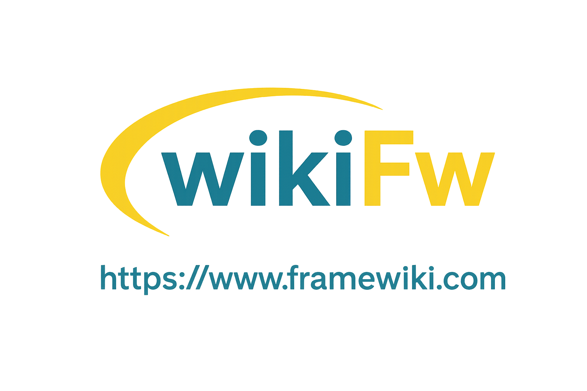

<p align="center">
  <a href="https://framewiki.com">
    
  </a>
</p>

<p align="center">
  <a href="https://framewiki.com">https://framewiki.com/</a>
</p>

<p align="center">
  <a target="_blank" href="https://search.maven.org/artifact/com.framewiki/wiki-all">
    
  </a>
  <a target="_blank" href="https://license.coscl.org.cn/MulanPSL2">
    
  </a>
  <a target="_blank" href="https://www.oracle.com/java/technologies/javase/jdk17-0-13-later-archive-downloads.html">
    
  </a>
  <a href="https://gitee.com/cdkjframework/wiki-framework/stargazers">
    
  </a>
  <a href="https://gitee.com/cdkjframework/wiki-framework/members">
    
  </a>
</p>

## Introduction

Wiki-Framework is a modular foundational framework and utility library for Java backend development, built on JDK 17, Spring Boot 3.3.x, and Spring Cloud 2023.0.x. It packages commonly used capabilities in daily business development into independently importable Maven modules, covering utilities, unified responses, exception handling, data sources, caching, message queues, Socket, object storage, authorization, security, API documentation, code generation, and more.

The project aims to reduce repetitive boilerplate code so developers can set up enterprise application infrastructure faster, while keeping a clear source structure and Chinese comments in the codebase for easy customization, learning, and on-demand trimming.

## Highlights

- **Modular design**: Split into modules such as `wiki-util`, `wiki-core`, `wiki-datasource`, `wiki-redis`, `wiki-security`, `wiki-minio`, and `wiki-swagger`. Import individually or use the aggregated `wiki-all` package.
- **Modern stack**: Supports JDK 17+, built on Spring Boot 3.3.x and Spring Cloud 2023.0.x, suitable for greenfield infrastructure projects.
- **Comprehensive utilities**: String, date, collection, file, I/O, encryption, JSON, HTTP, JWT, Excel, QR code, email, push notifications, logging, pagination, database access, and more.
- **Enterprise building blocks**: Multi-data-source support, read/write splitting, Redis, Kafka, MQTT, RocketMQ, Socket, WebSocket, SSE, MinIO, Spring Security, OAuth2, config center, and related integrations.
- **Code generation & API docs**: Database reverse-engineering for code generation, plus OpenAPI/Swagger documentation support.
- **Open-source friendly**: Licensed under Mulan Permissive Software License 2.0. Issues, PRs, and real-world feedback are welcome.

## Use Cases

- Bootstrapping Spring Boot / Spring Cloud projects.
- Shared infrastructure for admin panels, back-office systems, and microservices.
- Java projects that need unified utilities, response wrappers, exception handling, logging, authentication, data sources, caching, and messaging.
- Learning how enterprise Java components are split, packaged, and organized in a Maven multi-module project.

## Tech Stack

| Category | Technology |
| --- | --- |
| Runtime | JDK 17+ |
| Framework | Spring Boot 3.3.x, Spring Cloud 2023.0.x |
| Data Access | MyBatis, Spring Data JPA, MongoDB, PageHelper, Druid |
| Cache | Redis |
| Message Queue | Kafka, MQTT, RocketMQ |
| Communication | Socket, WebSocket, SSE |
| Object Storage | MinIO, Alibaba Cloud OSS |
| Security | Spring Security, OAuth2, JWT |
| Documentation | OpenAPI / Swagger / Knife4j |
| Build | Maven |

## Modules

| Module | Description |
| --- | --- |
| `wiki-pom` | Centralized dependency version management, used as BOM/parent POM. |
| `wiki-all` | Aggregated package of common modules for quick adoption of Wiki-Framework. |
| `wiki-all-jpa` | Aggregated package for JPA-based projects. |
| `wiki-core` | Core startup config, unified responses, request/response handling, global exceptions, and other basics. |
| `wiki-util` | Utilities for string, date, collection, file, I/O, encryption, HTTP, JSON, JWT, Excel, email, push, and more. |
| `wiki-constant` | Shared constants, enums, cache keys, error codes, return codes, etc. |
| `wiki-entity` | Base entities, pagination params/results, unified response objects, etc. |
| `datasource/wiki-datasource` | MyBatis data source, pagination plugin, and database operation utilities. |
| `datasource/wiki-datasource-jpa` | JPA data source and Repository utilities. |
| `datasource/wiki-datasource-mongodb` | MongoDB data access utilities. |
| `datasource/wiki-datasource-rw` | MyBatis read/write splitting utilities. |
| `cache/wiki-redis` | Redis connection, caching, distributed locks, pub/sub, etc. |
| `queue/wiki-kafka` | Kafka producer utilities. |
| `queue/wiki-kafka-client` | Kafka consumer utilities. |
| `queue/wiki-mqtt` | MQTT producer utilities. |
| `queue/wiki-mqtt-client` | MQTT consumer utilities. |
| `queue/wiki-rocket` | RocketMQ producer utilities. |
| `queue/wiki-rocket-client` | RocketMQ consumer utilities. |
| `socket/wiki-socket` | Socket server utilities. |
| `socket/wiki-socket-client` | Socket client utilities. |
| `socket/wiki-sse` | SSE server utilities. |
| `socket/wiki-web-socket` | WebSocket server utilities. |
| `socket/wiki-web-socket-client` | WebSocket client utilities. |
| `wiki-log` | AOP-based logging, parameter injection, and related capabilities. |
| `wiki-minio` | MinIO file upload, download, delete, existence check, listing, etc. |
| `security/wiki-security` | Spring Security authentication, authorization, captcha, token, QR login, etc. |
| `security/wiki-oauth2` | OAuth2-related utilities. |
| `config/wiki-config` | Spring Cloud Config reading utilities. |
| `config/wiki-nacos-config` | Nacos config reading utilities. |
| `config/wiki-nacos-cloud-config` | Nacos and Spring Cloud config integration. |
| `wiki-message` | Messaging utilities such as Alibaba Cloud SMS. |
| `wiki-cloud` | Spring Cloud utilities for service discovery, calls, config, circuit breaking, rate limiting, and fallback. |
| `wiki-center` | Code generation from MySQL, PostgreSQL, and other databases for entities, controllers, services, mappers, repositories, etc. |
| `licenses/wiki-license` | License generation and verification utilities. |
| `licenses/wiki-license-core` | License core capabilities. |
| `licenses/wiki-license-verify` | License verification capabilities. |
| `wiki-swagger` | OpenAPI/Swagger documentation generation utilities. |
| `wiki-ai` | AI-related extension module. |

## Quick Start

### Requirements

- JDK 17 or later
- Maven 3.8 or later

> Starting from `1.0.8`, Wiki-Framework only supports JDK 17+. If your project still uses JDK 8, please use version `1.0.7` or earlier. Older versions are no longer maintained.

### Maven

To import common modules at once, use `wiki-all`:

```xml
<dependency>
  <groupId>com.framewiki</groupId>
  <artifactId>wiki-all</artifactId>
  <version>1.2.0</version>
</dependency>
```

To manage Wiki-Framework dependency versions centrally, import `wiki-pom` in your project:

```xml
<dependencyManagement>
  <dependencies>
    <dependency>
      <groupId>com.framewiki</groupId>
      <artifactId>wiki-pom</artifactId>
      <version>1.2.0</version>
      <type>pom</type>
      <scope>import</scope>
    </dependency>
  </dependencies>
</dependencyManagement>
```

Then import specific modules as needed:

```xml
<dependency>
  <groupId>com.framewiki</groupId>
  <artifactId>wiki-util</artifactId>
</dependency>
```

### Gradle

```groovy
implementation 'com.framewiki:wiki-all:1.2.0'
```

### Enable Framework Features

Add `@EnableAutoWiki` to your Spring Boot application class:

```java
import com.cdkjframework.all.annotation.EnableAutoWiki;
import com.cdkjframework.core.spring.CdkjApplication;
import org.springframework.boot.autoconfigure.SpringBootApplication;

@EnableAutoWiki
@SpringBootApplication
public class DemoApplication {

  public static void main(String[] args) {
    CdkjApplication.run(DemoApplication.class, args);
  }
}
```

## Build from Source

After cloning the repository, use the scripts in the project root to install, package, and generate documentation.

Linux / macOS:

```sh
./wiki.sh install
./wiki.sh doc
./wiki.sh pack
```

Windows PowerShell:

```powershell
.\wiki.ps1 install
.\wiki.ps1 doc
.\wiki.ps1 pack
```

Script commands:

| Command | Description |
| --- | --- |
| `install` | Run Maven install to build and install artifacts into the local Maven repository. |
| `doc` | Generate aggregated Java API documentation under `target/site/apidocs`. |
| `pack` | Run Maven package to build jar files for each module. |

You can also build and install directly with Maven:

```sh
mvn clean install -DskipTests
```

After the build completes, the corresponding modules will be available in your local Maven repository.

## Documentation & Links

- Official docs: [https://framewiki.com/wiki-framework](https://framewiki.com/wiki-framework)
- API docs: [https://framewiki.com/wiki-framework/apidocs/](https://framewiki.com/wiki-framework/apidocs/)
- Maven Central: [https://repo1.maven.org/maven2/com/framewiki/wiki-all/](https://repo1.maven.org/maven2/com/framewiki/wiki-all/)
- Gitee: [https://gitee.com/cdkjframework/wiki-framework](https://gitee.com/cdkjframework/wiki-framework)
- GitHub: [https://github.com/cdkjframework/wiki-framework](https://github.com/cdkjframework/wiki-framework)
- Example project: [https://gitee.com/cdkjframework/framewiki-example](https://gitee.com/cdkjframework/framewiki-example)
- Chinese README: [README.md](./README.md)

## Branches

| Branch | Description |
| --- | --- |
| `master` | Stable release branch, aligned with versions published to Maven Central. |
| `dev` | Development branch for new features, bug fixes, and pull requests. |

## Contributing

Issues and pull requests are welcome. To make maintenance easier, please follow these guidelines:

1. When filing an issue, include JDK version, Wiki-Framework version, relevant dependency versions, reproduction steps, and expected results.
2. Add JavaDoc for new public methods, describing purpose, parameters, return values, and exceptions.
3. When modifying shared modules, add or update tests where possible to avoid breaking existing users.
4. Follow IntelliJ IDEA default Java code formatting.
5. Submit pull requests to the `dev` branch and describe the purpose, impact scope, and verification steps.

## Feedback & Community

- Gitee issues: [https://gitee.com/cdkjframework/wiki-framework/issues](https://gitee.com/cdkjframework/wiki-framework/issues)
- GitHub issues: [https://github.com/cdkjframework/wiki-framework/issues](https://github.com/cdkjframework/wiki-framework/issues)
- Email: [wiki@framewiki.com](mailto:wiki@framewiki.com)
- QQ group: 25056933
- WeChat official account: 维基框架 (framewiki-com)

## Adopters

The following companies or teams have registered use of Wiki-Framework. Feel free to add more real-world cases via issues:

1. Hongtu Logistics Co., Ltd.
2. Chengdu Lexiang Zhijia Technology Co., Ltd.
3. Chengdu Lingshu Cloud Technology Co., Ltd.
4. Chengdu Qianjie Wanxiang Business Services Co., Ltd.
5. Chengdu Lanmou Intelligent Technology Co., Ltd.

## License

This project is open source under [MulanPSL-2.0](./LICENSE).
